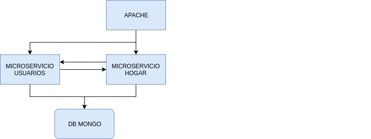

# Ejercicios del tema 1 de la asignatura CC

## Ejercicio 1
*Buscar una aplicación de ejemplo, preferiblemente propia, y deducir qué patrón es el que usa. ¿Qué habría que hacer para evolucionar a un patrón tipo microservicios?*

Para el desarrollo del trabajo de fin de grado se realizaron dos servicios independientes a los que el servidor web hacía llamadas a su api para interactuar con ellos. La arquitectura sería la siguiente:

La arquitectura usada sería de microservicios.
## Ejercicio 2
*En la aplicación que se ha usado como ejemplo en el ejercicio anterior, ¿podría usar diferentes lenguajes? ¿Qué almacenes de datos serían los más convenientes?*

Si. Cada servicio puede ser desarrollado en el lenguaje que se quiera. Teniendo una API accesible por los demás microservicios no habría problema. Además, como cada servicio es independiente de los demás, cada uno puede utilizar los almacenes de datos que más le convengan.
